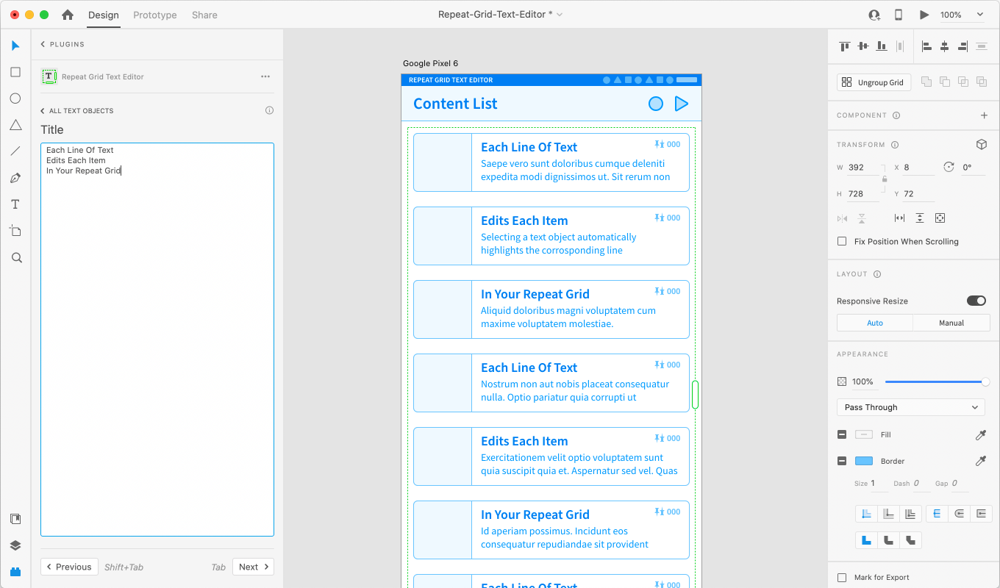
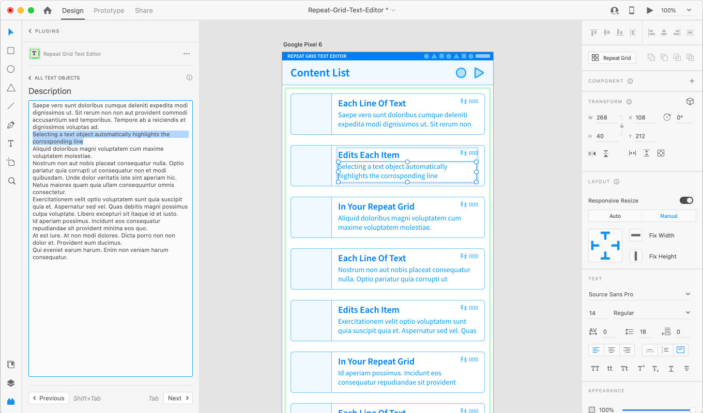
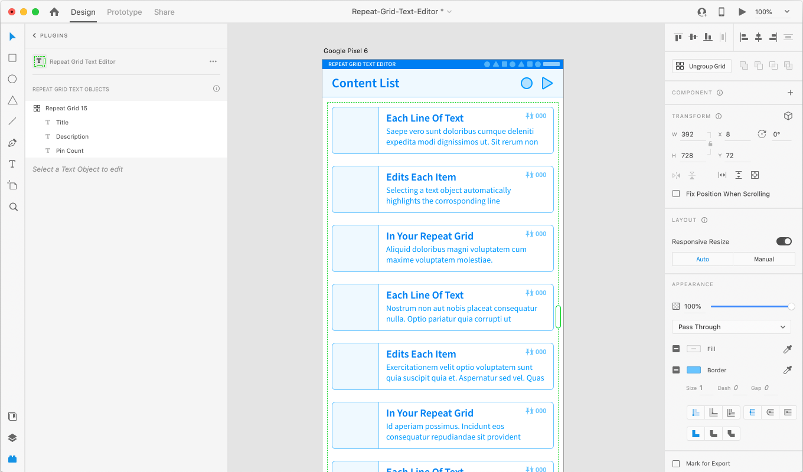

# Repeat Grid Text Editor - XD Plugin
Quickly edit text in Repeat Grids in Adobe XD

Each line of text edits each item in your Repeat Grid

Selecting a text object automatically highlights the corresponding line

Navigate and select Repeat Grid text layers

## Getting started with development
- `yarn start` to run the repo in dev watch mode
- [Launch Chrome DevTools](https://adobexdplatform.com/plugin-docs/tutorials/debugging/#2-launch-chrome-devtools)
  - Open [`chrome://inspect/`](chrome://inspect/) 
  - setup once via "Connect to Device" if you haven't before
  - click "inspect" and refresh <kbd>Cmd+R</kbd> in the inspector to update the app.
- OR use UXP dev tools if Adobe ever fixes it
  - [XD Plugin Samples with React don’t load in the UXP Developer Tools](https://forums.creativeclouddeveloper.com/t/xd-plugin-samples-with-react-dont-load-in-the-uxp-developer-tools/4023)

## Development Links
- [XD Plugin Docs](https://www.adobe.io/xd/uxp/)
- [Old XD Plugin Docs](https://adobexdplatform.com/plugin-docs/)
- [TypeScript AdobeXD Plugin Boilerplate](https://github.com/joshferrell/adobexd-react-typescript)

